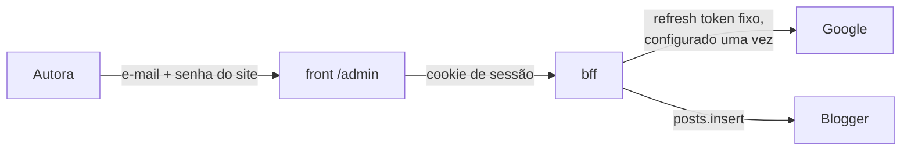

# Mochi Blog

Blog conectado à API do Blogger. Três pacotes em um monorepo:

```
mochiblog/
  app/
    bff/        API em Fastify que fala com o Blogger, sanitiza e cacheia
    front/      Site em Nuxt 3, renderizado no servidor
  packages/
    shared/     Tipos e schemas Zod compartilhados pelos dois
  docs/
    arquitetura.md   Por que cada decisão foi tomada (vale ler)
```

O front **não** fala com o Google. Quem fala é o BFF. O navegador só conversa
com o próprio domínio, através de um proxy. Isso elimina CORS, esconde a chave
da API e permite cachear. Os detalhes estão em [`docs/arquitetura.md`](docs/arquitetura.md).

## Passo 0 — a chave de API do Blogger

Faça isso antes de rodar qualquer coisa. É o que valida a ideia inteira.

1. Acesse <https://console.cloud.google.com> e crie um projeto (pode ser vazio).
2. Em **APIs e serviços → Biblioteca**, procure por **Blogger API v3** e habilite.
3. Em **Credenciais → Criar credenciais → Chave de API**, copie o valor.
4. Ainda na chave, em **Restrições de APIs**, marque apenas **Blogger API v3**.
   Em **Restrições de aplicativo**, deixe **Nenhuma**: a chave é usada só no
   servidor, e restrição por IP quebraria quando o provedor trocar de IP.

Confirme que ela funciona, trocando `SEU_BLOG` e `SUA_CHAVE`:

```bash
curl "https://www.googleapis.com/blogger/v3/blogs/byurl?url=https://SEU_BLOG.blogspot.com&key=SUA_CHAVE"
```

A resposta traz o `id` numérico do blog. Guarde: você pode colocá-lo em
`BLOGGER_BLOG_ID` para economizar uma chamada na inicialização.

> O blog precisa estar **público**. Um blog privado exige OAuth de usuário, e aí
> o fluxo é bem mais chato. Se ele estiver em rascunho, publique antes.

## Rodar local

```bash
pnpm install

# configuração
cp app/bff/.env.example app/bff/.env      # e cole a chave real
cp app/front/.env.example app/front/.env

pnpm dev
```

Isso sobe os dois serviços:

| Serviço | Endereço | O que é |
|---|---|---|
| BFF | <http://localhost:3001> | API de conteúdo |
| Front | <http://localhost:3000> | O site |

Acesse <http://localhost:3000>.

## Endpoints do BFF

Todos sob `/api`. O front chama exatamente estes caminhos.

| Rota | O que devolve |
|---|---|
| `GET /api/posts?page=1&pageSize=10&label=receitas` | Lista paginada |
| `GET /api/posts/:slug` | Um post, com o HTML já sanitizado |
| `GET /api/posts/search?q=bolo` | Busca por título e texto |
| `GET /api/labels` | Categorias com contagem |
| `GET /api/health` | Estado do índice. Não dispara varredura. |

## Comandos

```bash
pnpm dev              # sobe BFF e front juntos
pnpm dev:bff          # só o BFF
pnpm dev:front        # só o front
pnpm typecheck        # checa os três pacotes
pnpm build            # build de produção
```

## Deploy no Vercel

Dois projetos, apontando para pastas diferentes do mesmo repositório. O motivo da
separação é o de sempre: o BFF guarda o refresh token do Google, e isso não pode
encostar no navegador.

O repositório precisa estar no GitHub, GitLab ou Bitbucket. O `.env` está no
`.gitignore`, então nenhum segredo viaja no push: as variáveis são cadastradas à
mão, no painel do Vercel. Os dois `.env.example` são a lista de conferência.

### Antes de começar

Duas coisas que o build de produção exige e o desenvolvimento não cobra.

**1. Fixe a versão do pnpm.** O `allowBuilds` do `pnpm-workspace.yaml` é chave do
**pnpm 11**. Sem instrução em contrário, o Vercel escolhe o pnpm pela versão do
lockfile — e o seu lockfile diz `lockfileVersion: '9.0'`, que é a mesma versão
gravada pelo pnpm 9, 10 e 11. Ou seja: ele não tem como saber que precisa do 11.
Instalando com outro, a chave é ignorada, o script de instalação do esbuild não
roda, e o build quebra com um erro que não menciona nada disso. Acrescente ao
`package.json` da raiz:

```json
"packageManager": "pnpm@11.25.0"
```

**2. Use Node 22 nos dois projetos.** O `src/env.ts` do BFF chama
`process.loadEnvFile`, que é do Node 22. O `engines` da raiz diz `>=20.11`, e isso
não basta. Confira em Settings > Node.js Version.

### Você não precisa ter URL nenhuma agora

Vale dizer isto antes de tudo, porque é o que mais confunde: **no primeiro deploy
você não tem URL alguma, e isso é o esperado.** Cada deploy é que cria a URL que o
passo seguinte precisa. O custo dessa ordem é um ou dois redeploys, que no Vercel
levam menos de um minuto.

O que existe é uma dependência, e ela dita a sequência:

- o **BFF** precisa da URL do front, para montar o endereço de redirecionamento do
  Google (`SITE_ORIGIN`);
- o **front** precisa da URL do BFF (`BFF_URL`), lida em **tempo de build**, porque
  alimenta o `routeRules.proxy` do Nitro.

A regra, então, é uma só: **sobe um, anota a URL, usa no outro.** E como variável
de ambiente de função serverless só passa a valer depois de um novo deploy,
voltar no BFF no fim não é opcional.

Onde a URL aparece: assim que o deploy termina, o Vercel mostra o domínio no topo
da página do projeto, na aba Domains. O formato é sempre
`https://<nome-do-projeto>.vercel.app`, e o nome do projeto é você que escolhe na
hora de criar.

### 1. Projeto do BFF

| Campo | Valor |
|---|---|
| Root Directory | `app/bff` |
| Framework Preset | Other |
| Build Command | deixe o padrão |

Nada de build command especial. A função em `api/[...path].ts` é detectada
automaticamente, e o `app` fica fora do handler de propósito, para o índice de
posts sobreviver entre invocações.

Variáveis:

```
BLOGGER_API_KEY
BLOGGER_BLOG_URL
BLOGGER_BLOG_ID
SITE_ORIGIN            <- deixe para depois; só se sabe no passo 3
ADMIN_USER
ADMIN_PASSWORD_HASH
SESSION_SECRET
GOOGLE_CLIENT_ID
GOOGLE_CLIENT_SECRET
GOOGLE_REFRESH_TOKEN
```

Não cadastre `PORT` (o Vercel não abre porta) nem `CORS_ORIGINS` (o front fala com
o BFF pelo proxy, então não existe requisição cross-origin para autorizar).
`NODE_ENV` o Vercel define sozinho; cadastrar também não faz mal.

`SITE_ORIGIN` tem valor padrão (`http://localhost:3000`), então o BFF sobe sem ela
e serve a API normalmente. Só o fluxo de autorização do Google depende dela, e
quando você chegar nesse ponto a URL do front já vai existir.

⚠️ `SESSION_SECRET` e `GOOGLE_REFRESH_TOKEN` são segredos de verdade. Marque os
dois como sensíveis no painel, e nunca os cole em arquivo que vá para o
repositório.

⚠️ **Trocar o `SESSION_SECRET` invalida todas as sessões abertas.** O cookie é
criptografado com ele. Se você entrar no painel e de repente ele pedir login sem
motivo, foi isso.

**Ao terminar o deploy, anote a URL do projeto.** É ela que alimenta o `BFF_URL`
do passo seguinte.

### 2. Projeto do Front

| Campo | Valor |
|---|---|
| Root Directory | `app/front` |
| Framework Preset | Nuxt.js (detectado automaticamente) |

Variáveis:

```
BFF_URL               <- a URL anotada no fim do passo 1, sem barra no fim
NUXT_PUBLIC_SITE_URL  <- deixe vazio agora; ainda não existe
```

⚠️ **Não esqueça a `NUXT_PUBLIC_SITE_URL`.** Sem ela, o `siteUrl` fica no padrão do
`nuxt.config.ts`, que é `http://localhost:3000`, e o `canonical` e o `og:url` de
todas as páginas passam a apontar para localhost. Nenhuma tela mostra isso: só o
HTML. Para um site que existe para aparecer em busca, é o pior defeito possível,
e o mais silencioso.

⚠️ `BFF_URL` é lida em **tempo de build**. Se você definir depois do primeiro
deploy, precisa refazer o build para o proxy apontar para o lugar certo.

**Sobre a `NUXT_PUBLIC_SITE_URL`:** como o front ainda não foi publicado, você não
tem essa URL agora. Duas saídas.

- **Deixe vazio e complete depois.** Faça o deploy, copie a URL que o Vercel deu,
cadastre e faça o deploy de novo. Uma passada a mais, e nada é adivinhado. É o
caminho recomendado.
- **Adiante o nome do projeto.** Se você nomear o projeto de `mochiblog-front`, o
endereço de produção será `https://mochiblog-front.vercel.app`, e dá para cadastrar
de primeira. Só vale se você não se importar de conferir depois.

Não faça o deploy do front antes do BFF: sem o `BFF_URL` o proxy cai no padrão
(`http://localhost:3001`) e o site sobe quebrado, com tudo respondendo erro de
conexão. O deploy funciona, o site não.

### 3. Fechar o círculo

É aqui que as duas URLs se encontram. São dois redeploys, e nenhum é opcional.

1. **Anote a URL do front**, que o Vercel mostrou no fim do deploy do passo 2.
2. **No projeto do front**, cadastre essa URL em `NUXT_PUBLIC_SITE_URL` e faça o
   deploy de novo. É isso que corrige o `canonical` e o `og:url`.
3. **No projeto do BFF**, cadastre a mesma URL em `SITE_ORIGIN` e faça o deploy de
   novo. Sem isso, o endereço de redirecionamento do Google continua apontando
   para localhost, e a autorização falha reclamando de endereço não cadastrado.
4. **No Google Cloud**, cadastre o endereço de retorno:

   ```
   https://<projeto-do-front>.vercel.app/api/auth/google/callback
   ```

O `GOOGLE_REFRESH_TOKEN` **não precisa ser refeito**: ele está amarrado ao client
ID e aos escopos, não ao endereço de redirecionamento.

⚠️ **Publique o app no Google Cloud.** Enquanto a tela de permissão OAuth estiver
em "Em teste", o Google expira os refresh tokens em **7 dias**. Na prática: a
escrita funciona hoje e para sozinha na semana que vem, com um `invalid_grant` que
não explica o motivo. Com escopos sensíveis, publicar sem verificação ainda mostra
o aviso de app não verificado, mas o token deixa de morrer a cada semana.

### 4. Conferir depois do deploy

- `/api/health` responde, com a contagem certa de posts.
- A barra de abas mostra os rótulos.
- `/admin` pede login, e entra com o `ADMIN_USER`.
- O painel diz "Configurada. Os posts saem como ...". Se disser outra coisa, ele
  já conta qual dos dois 403 foi e o que fazer.
- O `<link rel="canonical">` no HTML aponta para o domínio do Vercel, e não para
  localhost.

### Se o build quebrar

Dois pontos frágeis, nenhum deles exercitado até hoje.

- **O `packages/shared` exporta `.ts` direto**, sem etapa de build. É padrão
  conhecido de monorepo, mas depende de o empacotador resolver. As saídas estão na
  seção 6 de [`docs/arquitetura.md`](docs/arquitetura.md): gerar `dist` com
  `tsup`/`tsc`, ou configurar `transpile` no bundler.
- **O BFF importa `../src/app.js`** enquanto o arquivo é `app.ts`. Isso é o estilo
  `NodeNext` do TypeScript e funciona local porque o `tsx` resolve. Não é certo que
  o compilador do Vercel resolva igual.

Os dois aparecem **só no deploy**, o que é o pior lugar para descobrir. O jeito de
antecipar é rodar `vercel build` na própria máquina, onde o ciclo de tentativa é
de segundos.

## Painel restrito

O painel fica em **`/admin`** e não aparece no menu do site. Não há link público
para ele: quem precisa do endereço já sabe qual é.

| Estado | O que a página mostra |
|---|---|
| Sem sessão | O formulário de entrada |
| Com sessão | O painel, com o estado do serviço |

A rota é `noindex, nofollow` e é renderizada **só no navegador**. O motivo é uma
consequência do cookie de sessão ter `Path=/api`, explicada na seção 9 do
`docs/arquitetura.md`.

Para entrar, use o `ADMIN_USER` e a senha que corresponde ao
`ADMIN_PASSWORD_HASH`.

## Permissão de escrita

Escrever no Blogger exige **duas coisas diferentes**, e é fácil confundir uma com
a outra.

**Quem entra no painel** é o login do próprio site: usuário e senha nossos,
guardados no servidor. É o que a autora vê. Nada de Google.

**Quem pode escrever no Blogger** é uma autorização do Google, obtida **uma única
vez**, na instalação. Ela vira uma variável de ambiente e nunca aparece numa
tela. Pense nela como uma segunda API key, desta vez com poder de escrita: a que
já usamos só lê.



### 1. Senha do painel

```bash
pnpm --filter @mochiblog/bff hash:password
```

Cole a saída em `ADMIN_PASSWORD_HASH`. O que vai para o `.env` é o hash, nunca a
senha: se o arquivo vazar, ninguém entra no painel com ele.

### 2. Permissão do Google

Esta é a parte chata, e é feita **uma única vez**. Depois disso, ninguém mais vê
tela do Google.

**Passo 2.1 — Tela de permissão OAuth**

No <https://console.cloud.google.com>, escolha o **mesmo projeto** onde já está a
API key. Depois vá em **APIs e serviços → Tela de permissão OAuth**:

| Campo | O que pôr |
|---|---|
| Tipo de usuário | **Externo** |
| Nome do app | qualquer coisa, ex.: `Mochiblog` |
| E-mail de suporte | o seu |
| E-mail do desenvolvedor | o seu |
| Escopos | adicione `https://www.googleapis.com/auth/blogger` |
| Usuários de teste | **a conta Google que administra o blog** |

Salve.

> O nome do menu varia um pouco entre versões do console. Se não achar "Tela de
> permissão OAuth", procure por "OAuth consent screen" ou "Tela de consentimento".

**Passo 2.2 — Criar o cliente OAuth**

Ainda em **APIs e serviços → Credenciais → Criar credenciais → ID do cliente
OAuth**:

- Tipo de aplicativo: **Aplicativo da Web**
- Nome: `Mochiblog BFF`
- **URIs de redirecionamento autorizados**: cole exatamente este endereço

  ```
  http://localhost:3000/api/auth/google/callback
  ```

  (em produção você acrescenta o do domínio real, na mesma lista)

Crie, e copie o **ID do cliente** e a **chave secreta**.

**Passo 2.3 — Preencher e reiniciar**

Cole os dois valores em `app/bff/.env`:

```
GOOGLE_CLIENT_ID=...
GOOGLE_CLIENT_SECRET=...
```

Reinicie o BFF (o `.env` só é lido na inicialização) e recarregue o painel em
`/admin`. O cartão "Permissão de escrita" passa a mostrar o botão
**Conectar com o Google**.

**Passo 2.4 — Autorizar**

Clique em **Conectar com o Google** e aceite com a conta que administra o blog.

O Google vai avisar que o aplicativo não é verificado — isso é esperado num app
pessoal. Clique em **Avançado → Acessar (não seguro)**.

No fim, a página mostra o `refresh_token`. Copie, cole em
`GOOGLE_REFRESH_TOKEN` no `.env` e reinicie o BFF. O aviso do painel deve sumir.

> **O token aparece uma única vez.** Ele não fica guardado em lugar nenhum. Se
> perder, é só repetir o passo 2.4 — a autorização pode ser feita quantas vezes
> for preciso.

**Se parar de funcionar depois de alguns dias**

A causa provável é o app estar em modo de **teste** no Google Cloud, que emite
token de curta duração. O sintoma é a escrita responder 502 com
`invalid_grant` no log. As saídas são repetir o passo 2.4, ou mudar o app para
**Em produção** na tela de permissão — o que dispensa verificação para uso
pessoal, ao custo de manter o aviso de "app não verificado" na tela de
autorização.

**Enquanto as variáveis estiverem vazias**, as rotas de escrita respondem `503`
com a lista do que falta — de propósito, para o estado ficar visível em vez de
virar um 404 misterioso.

### Limitação conhecida: fotos

A API do Blogger **não tem endpoint de upload de imagem**. Os recursos são
`blogs`, `comments`, `pages`, `posts`, `pageViews`, `postUserInfos`, `users` e
`blogUserInfos`; nenhum de mídia. O editor do Blogger sobe foto por um caminho
interno que não está na API pública.

Por isso as rotas de escrita devolvem um `editUrl`, que abre o post no editor do
Blogger. O fluxo que funciona bem: escrever o texto pelo painel e, quando o post
tiver foto, adicionar as imagens lá.

## Detalhes que valem saber

**Rodou `pnpm build` e depois o `pnpm dev` começou a dar erro de `#app-manifest`?**
Rode `pnpm --filter @mochiblog/front clean` e suba o dev de novo. O build e o dev
compartilham o cache do Vite, e o build deixa esse cache num estado que o dev não
consegue reaproveitar. O `clean` apaga `.nuxt`, `.output` e `node_modules/.cache`.
Verificado: foi exatamente o que aconteceu aqui, e foi o que resolveu.

**As abas do topo saem de `/api/labels`.** Não existe lista de assuntos fixa no
código: se um rótulo novo aparecer no Blogger, uma aba nova aparece sozinha. Cada
aba é um link para `/tag/<rótulo>`, então tem endereço próprio e é
compartilhável. As consequências dessa escolha estão em
[`docs/arquitetura.md`](docs/arquitetura.md), seção 8.

**No Windows, os acentos do log aparecem quebrados.** É o terminal do
PowerShell, não o código: os arquivos são UTF-8 e a resposta HTTP também (dá
para conferir com `curl`). Se incomodar, use o Windows Terminal ou rode
`chcp 65001` antes de subir o servidor.

**Nada de conteúdo fica nos componentes.** Mesma regra do projeto `bio`: o texto
vem do Blogger, e o que é interface vive em `useRuntimeConfig().public`.

**Se o BFF cair, o site mostra erro em vez de mentir.** Uma falha de
infraestrutura vira 502, nunca 404. Devolver 404 faria o Google desindexar posts
que estão no ar.

## Próximos passos

Estão listados com prioridade em [`docs/arquitetura.md`](docs/arquitetura.md),
na seção "Pendências". Os três primeiros:

1. Trocar as cores e a tipografia pela identidade real do blog.
2. Publicar e configurar o canonical do lado do Blogger (evita conteúdo duplicado).
3. Sitemap e RSS.
